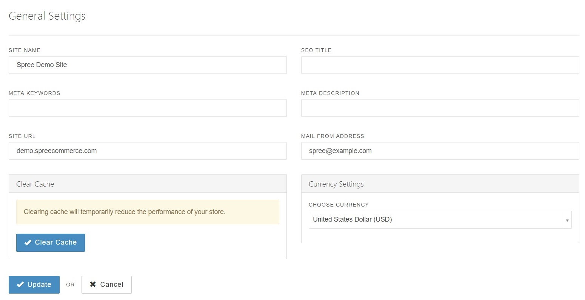
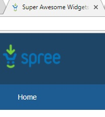
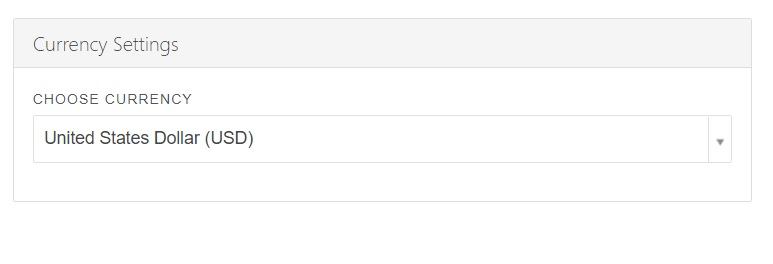
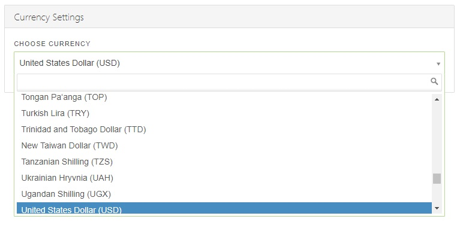

## Introduction

The General Settings section is where you will make site-wide settings about things like your store's name, security, and currency display. You can access this area by going to your Admin Interface, clicking "Configuration", then clicking the "General Settings link."

Each setting on the page is covered below.

### Site Name

The Site Name is what is set in the `<title>` tag of your website. It renders in your browser's title bar on every page of the public-facing area of the site.

### Default SEO Title

"SEO" stands for "Search Engine Optimization". It is a way to improve your store's visibility in search results. If you assign a value to the Default SEO Title field, it would override what you had set for the "Site Name" field.

### Default Meta Keywords

Meta keywords give search engines more information about your store. Use them to supply a list of the words and phrases that are most relevant to the products you offer. These keywords show up in the header of your site. The header is not visible to the casual site visitor, but it does inform your rankings with web browsers.

***
For more information about Search Engine Optimization, try reading the [Google Webmaster Tools topic](https://support.google.com/webmasters/answer/35291?hl=en) on the subject.
***

### Default Meta Description

Whereas meta keywords constitutes a comma-separated list of words and phrases, the meta description is a fuller, prose description of what your store is and does. The phrasing you use can help distinguish you from any other e-commerce websites offering products similar to yours.

### Site URL

The site's URL is the website address for your store, such as "http://myawesomestore.com". This address is used when your application sends out confirmation emails to customers about their purchases.

## Currency Settings

The remaining settings all cover how currency is rendered in your store.

### Choose Currency

In the newest version of Spree, currency is chosen by the Primary Country you pick in Currency Settings.

