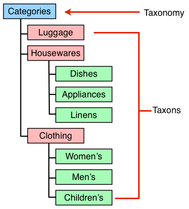
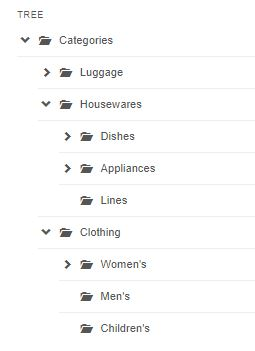
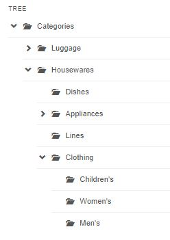
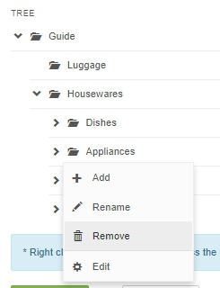
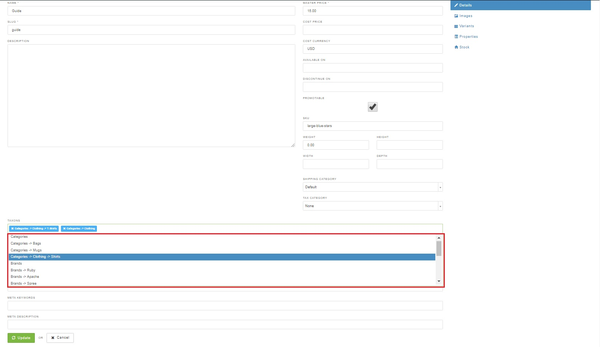

## Introduction

Taxonomies are the Spree system's approach to category trees. The heading of a tree is called a _Taxonomy_. Any child branches are called _Taxons_. Taxons themselves can have their own branches. So you could have something like the following categories structure:

In this example, "Categories" is the name of the Taxonomy. It has three child branches - "Luggage", "Housewares", and "Clothing". The last two branches each have three of their own child branches. Thus, "Clothing" is a child taxon to "Categories" and a parent taxon to "Men's".

To reach the Taxonomies list, first go to your Admin Interface, then click "Configurations" and "Taxonomies".

### Create a New Taxonomy

To create a new taxonomy, click the "New Taxonomy" button. Enter a name for the taxonomy and click "Create".

You can then [add child taxons](#adding-a-taxon-to-a-taxonomy) to your new taxonomy.

### Edit a Taxonomy

To edit an existing taxonomy, click the "Edit" icon next to the name in the Taxonomies list.

Here, you can change the name of the Taxonomy. You can also [reorder the child taxons](#reorder-a-taxon), [delete a taxon](#delete-a-taxon), [add a new taxon](#adding-a-taxon-to-a-taxonomy), or [edit a taxon](#edit-a-taxon). Make your changes, then click the Update button.

### Delete a Taxonomy

To delete a taxonomy, click the "Delete" icon next to the name in the Taxonomies list. Click "OK" to confirm.

### Adding a Taxon to a Taxonomy

Once you have created a taxonomy, you may want to add child taxons to it. Do do this, right-click the name of the Taxonomy, and click "Add".

This will cause a new input field to open up, with "New node" in it. Replace this text with the name of your new taxon, and hit Enter. You'll now see the child tax in the taxonomy tree.

Click "Update" to save your addition.

### Adding a Taxon to Another Taxon

If your site needs sub-trees, just add taxons to other taxons. To do so, right-click the name of what will become the parent taxon, and click Add.

Enter the name of the child taxon and click enter. Repeat this process for any sub-trees you need.

Remember to save your changes by clicking the "Update" button after you have added any taxons.

***
When you navigate away from your taxonomy's page, then navigate back to it, sub-trees will be collapsed by default. To see child taxons, just click the arrow next to the parent taxon.
***

### Reorder a Taxon

Taxons are displayed in the order you add them by default. To reorder them, just drag and drop them to their correct location in the tree.

Let's assume, for example, that we want the "Children's" taxon to be listed first, above "Women's" and "Men's". Just drag and drop the taxon to its new location.

You can even drag a parent taxon into the tree of a different parent taxon, merging it into the second taxon's sub-tree.

### Edit a Taxon

To edit a taxon's name, just right-click it and click "Edit".

Here, you can edit several aspects of the taxon:

* **Name** - A required field for all taxons. The name determines what the user will see when they look at this product in your store.
* **Permalink** - The end of the URL a user goes to, in order to see all products associated with this taxon. This field is also required, and a value is automatically generated for you when you create the taxon. Be careful with arbitrarily changing the permalink - if you have two taxons with the same permalink you will run into issues.
* **Icon** - This option is currently not functional.
* **Meta Title** - Overrides the store's setting for page title when a user visits the taxon's page on the front end of the website.
* **Meta Description** - Overrides the store's setting for meta description when a user visits the taxon's page on the front end of the website.
* **Meta Keywords** - Overrides the store's setting for meta keywords when a user visits the taxon's page on the front end of the website.
* **Description** - This option is currently not functional.

Remember to click "Update" after you make your changes.

### Delete a Taxon

To delete a taxon, right-click it in the taxonomy tree and click "Remove".

Click "OK" to confirm.

### Associating Products with Taxons

To associate a product with one or more taxons, go to the Admin Interface, and click the "Products" tab. Locate the product you want to edit, and click its "Edit" icon. Select the taxons for the product in the Taxons field.

